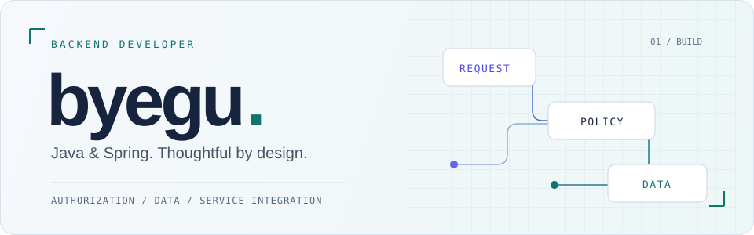

<picture>
  <source media="(prefers-color-scheme: dark)" srcset="assets/header-dark.svg">
  <source media="(prefers-color-scheme: light)" srcset="assets/header-light.svg">
  
</picture>

## 강병구 · Backend Developer

인증된 사용자가 **자신의 데이터에만 접근하도록**, 외부 서비스의 실패가 **다른 업무의 실패로 번지지 않도록** 구현합니다. 
Java와 Spring을 중심으로 인증·인가, 검색, 서비스 연동을 개발해 왔습니다.

**[프로젝트](#selected-work)** &nbsp; / &nbsp; **[기술 스택](#toolbox)** &nbsp; / &nbsp; **[알고리즘 기록](https://github.com/byegu/Algorithm)** &nbsp; / &nbsp; **[solved.ac](https://solved.ac/profile/rkdqudrn07)**

 

## Selected work

<table>
<tr><td>

01 &nbsp; / &nbsp; BACKEND · 2026.07 — 2026.08
<h3>DODAM · 도담</h3>

아이의 그림과 AI 대화를 보호자가 함께 돌아보는 서비스. 아동의 표현을 이해하기 위한 참고 정보를 제공하며, 심리 진단·치료를 목적으로 하지 않습니다.

<ul>
<li><b>인증·인가</b> — 보호자와 아동·그림 활동의 소유 관계를 공통 Validator로 검사하고, Redis Lua 기반 Refresh Token 회전과 재사용 감지를 구현했습니다.</li>
<li><b>AI 서비스 연동</b> — 60초 단일 사용 이미지 접근, 응답 검증, 오류 분류와 멱등 재시도 처리를 구현했습니다.</li>
<li><b>서버 리포트</b> — PDFBox와 openhtmltopdf를 비교하고, HTML/CSS 템플릿과 저장소 이미지 자산을 이용한 PDF 생성 경로를 구현했습니다.</li>
</ul>

<code>Java</code> <code>Spring Boot</code> <code>Spring Security</code> <code>Redis</code> <code>MySQL</code>

<a href="projects/dodam.md"><b>구현 과정 읽기 →</b></a>

</td></tr>
</table>

<table>
<tr><td>

02 &nbsp; / &nbsp; BACKEND · 2024.03 — 2024.05
<h3>No24 · 도서 쇼핑몰</h3>

도서를 찾고 주문하는 온라인 서점. 검색과 카테고리 등 백엔드 기능을 담당했습니다.

<ul>
<li><b>검색</b> — Elasticsearch의 도서명·저자·ISBN 등 여러 필드와 자소·n-gram 하위 필드, 페이지네이션을 사용하는 검색 흐름을 구현했습니다.</li>
<li><b>도메인과 테스트</b> — 자기참조 카테고리 구조와 용도별 응답 DTO를 다루고, CRUD·예외 처리 및 Controller/Service/Repository 테스트에 기여했습니다.</li>
</ul>

<code>Java</code> <code>Spring</code> <code>Elasticsearch</code> <code>QueryDSL</code> <code>Redis</code>

<a href="https://github.com/nhnacademy-be5-no24/no24-shop"><b>Shop Server ↗</b></a> &nbsp; · &nbsp; <a href="https://github.com/nhnacademy-be5-no24/no24-frontend">검색 구현 저장소 ↗</a> &nbsp; · &nbsp; <a href="projects/no24.md">구현 과정 →</a>

</td></tr>
</table>

<b>현재 작업 · 공동 공연 수익 정산 프로젝트</b>

 
팀장·프런트엔드 역할로 React·TypeScript 화면과 Web3Auth 지갑, Kaia 사용자 서명 흐름을 연동하고 있습니다. 진행 중인 작업으로, 완료 프로젝트와 구분해 기록합니다.

 

## Toolbox

프로젝트에서 사용한 기술을 중심으로 정리했습니다.

| 영역 | 기술 |
| :--- | :--- |
| **Backend** | Java · Spring Boot · Spring Security · JPA · QueryDSL |
| **Data & Search** | MySQL · Redis · Elasticsearch |
| **Delivery & Collaboration** | Docker · Jenkins · Git · GitHub Actions |

 

## Milestones

- **우수상** · SSAFY 공통 프로젝트 DODAM — 팀 수상
- **대상** · SW아카데미 NHN Academy 프로젝트 최종발표회 No24 — 팀 수상

**정보처리기사 · SQLD · TOEIC Speaking IH** 
SSAFY SW 역량평가 **A등급** · 2026.03.06

 

## Practice & activity

Java로 풀어 온 문제와 풀이 코드는 <a href="https://github.com/byegu/Algorithm"><b>Algorithm</b></a>에 모으고 있습니다.

 

<picture>
  <source media="(prefers-color-scheme: dark)" srcset="assets/activity-dark.svg">
  <source media="(prefers-color-scheme: light)" srcset="assets/activity-light.svg">
  
</picture>

Contribution art updates daily with GitHub Actions. Built with <a href="https://github.com/Platane/snk">snk</a>.
