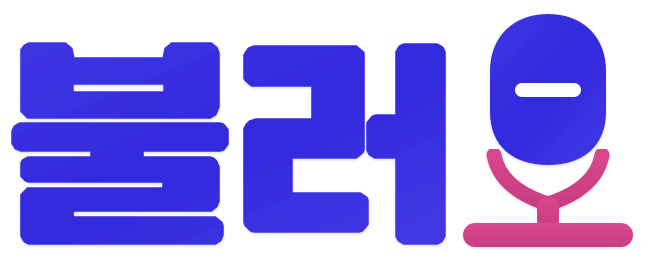

# 강병구 byegu

Java와 Spring으로 **인증·인가, 검색 API, 외부 서비스 연동**을 다뤘습니다. 
화면의 요청이 권한 검사와 데이터 저장을 거쳐 어디까지 처리됐는지 확인합니다.

[프로젝트](#프로젝트) &nbsp; · &nbsp; [기술 스택](#기술-스택) &nbsp; · &nbsp; [수상·자격](#수상자격) &nbsp; · &nbsp; [학습 기록](#학습-기록)

## 프로젝트

제가 맡은 구현과 판단을 중심으로 정리했습니다.

<table>
<tr><td>

01 &nbsp; · &nbsp; 2026.10 — 2026.11 &nbsp; · &nbsp; 백엔드
<h3><a href="projects/signull.md">Signull</a></h3>

시험 본부가 무선 신호 관측과 후보 구역을 보고, 감독관의 현장 확인을 교시 보고서에 남기는 서비스입니다.

<ul>
<li><b>센서 데이터</b> — MQTT 중계와 Spring 저장의 책임 분담에 참여하고, 계약에 맞춰 저장·재생을 검증할 순서를 정했습니다.</li>
<li><b>감독관 권한</b> — 시험별 승인·고사실 배정이 서버 권한에 반영되는 흐름을 검토하고, 두 탭의 로그인 충돌을 공유했습니다.</li>
<li><b>교시 보고서</b> — 본부가 현장 결과를 다시 입력하지 않아도 되도록 감독관 회신을 저장하는 흐름을 제안했습니다.</li>
</ul>

<code>Java 21</code> <code>Spring Boot</code> <code>PostgreSQL</code> <code>Flyway</code> <code>MQTT</code>

<a href="projects/signull.md"><b>백엔드 기여와 검증 →</b></a>

</td></tr>
</table>

<table>
<tr><td>

02 &nbsp; · &nbsp; 2026.07 — 2026.08 &nbsp; · &nbsp; 백엔드
<h3><a href="https://github.com/byegu/dodam">도담</a></h3>

아이의 그림과 AI 대화를 보호자가 함께 돌아보는 서비스입니다. 분석은 이해를 돕는 참고 정보이며, 심리 진단·치료를 제공하지 않습니다.

<ul>
<li><b>인증·인가</b> — 보호자와 아동·그림 활동의 소유 관계를 공통 Validator로 검사하고, Redis Lua 기반 Refresh Token 회전·재사용 감지를 구현했습니다.</li>
<li><b>AI 연동</b> — 60초 단일 사용 이미지 접근, 응답 검증, 오류 분류와 멱등 재시도 경계를 구현했습니다.</li>
<li><b>리포트</b> — PDFBox와 openhtmltopdf를 비교하고, HTML/CSS 템플릿과 저장소 이미지 자산을 이용한 서버 PDF 생성을 구현했습니다.</li>
</ul>

<code>Java</code> <code>Spring Boot</code> <code>Spring Security</code> <code>Redis</code> <code>MySQL</code>

<a href="https://github.com/byegu/dodam"><b>소스 저장소 ↗</b></a> &nbsp; · &nbsp; <a href="projects/dodam.md">구현 내용 →</a> <a href="https://github.com/byegu/dodam/blob/main/backend/src/main/java/com/ssafy/b209/infrastructure/ai/drawing/RestClientDrawingAnalysisClient.java">분석 클라이언트</a> &nbsp; · &nbsp; <a href="https://github.com/byegu/dodam/blob/main/backend/src/test/java/com/ssafy/b209/infrastructure/ai/drawing/RestClientDrawingAnalysisClientTest.java">테스트</a>

</td></tr>
</table>

<table>
<tr><td>

03 &nbsp; · &nbsp; 2026.08 — 2026.10 &nbsp; · &nbsp; 프론트엔드·팀장
<h3><a href="https://github.com/byegu/bulleoyo">불러요</a></h3>

여러 밴드의 공동 공연을 위한 티켓 예매·입장·수익 정산 플랫폼입니다. Kaia Kairos 테스트넷을 사용하는 시연용 서비스입니다.

<ul>
<li><b>결제 상태</b> — 서명 대기·처리 중·성공·실패를 구분하고, 최신 상태에서 성공을 확인한 뒤에만 완료 화면으로 이동하도록 구현했습니다.</li>
<li><b>실패 후 복구</b> — 재시도 전 주문·결제를 재조회하고 처리 중 중복 실행을 막았습니다. 실패한 작업을 복원하지 않고 새 멱등키로 서명 절차를 재개했습니다.</li>
<li><b>검증</b> — 상태 충돌·반영 지연·재서명·연속 재시도를 회귀 테스트로 확인했습니다. 스마트컨트랙트·백엔드 체인·인프라는 다른 팀원 담당입니다.</li>
</ul>

<code>React</code> <code>TypeScript</code> <code>Web3Auth</code> <code>Kaia</code>

<a href="https://github.com/byegu/bulleoyo"><b>소스 저장소 ↗</b></a> &nbsp; · &nbsp; <a href="projects/bulleoyo.md">구현 내용 →</a> <a href="https://github.com/byegu/bulleoyo/blob/main/frontend/src/pages/PaymentPage.tsx">결제 화면</a> &nbsp; · &nbsp; <a href="https://github.com/byegu/bulleoyo/blob/main/frontend/src/pages/PaymentPage.live.test.tsx">테스트</a>

</td></tr>
</table>

<table>
<tr><td>

04 &nbsp; · &nbsp; 2024.03 — 2024.05 &nbsp; · &nbsp; 백엔드
<h3><a href="https://github.com/nhnacademy-be5-no24/no24-shop">No24</a></h3>

도서를 찾고 주문하는 온라인 서점입니다. 검색·카테고리 등 백엔드 기능을 담당했습니다.

<ul>
<li><b>검색</b> — Elasticsearch로 도서명·저자·ISBN 등 여러 필드와 자소·n-gram 하위 필드, 페이지네이션을 사용하는 검색 흐름을 구현했습니다.</li>
<li><b>데이터와 테스트</b> — 자기참조 카테고리 구조와 용도별 응답 DTO를 다루고, CRUD·예외 처리 및 Controller/Service/Repository 테스트에 기여했습니다.</li>
</ul>

<code>Java</code> <code>Spring</code> <code>Elasticsearch</code> <code>QueryDSL</code> <code>Redis</code>

<a href="https://github.com/nhnacademy-be5-no24/no24-shop"><b>서버 저장소 ↗</b></a> &nbsp; · &nbsp; <a href="https://github.com/nhnacademy-be5-no24/no24-frontend">검색 구현 저장소 ↗</a> &nbsp; · &nbsp; <a href="projects/no24.md">구현 내용 →</a> <a href="https://github.com/nhnacademy-be5-no24/no24-shop/blob/develop/src/main/java/com/nhnacademy/shop/category/service/impl/CategoryServiceImpl.java">카테고리 서비스</a> &nbsp; · &nbsp; <a href="https://github.com/nhnacademy-be5-no24/no24-shop/blob/develop/src/test/java/com/nhnacademy/shop/category/controller/CategoryControllerTest.java">테스트</a>

</td></tr>
</table>

 

## 기술 스택

프로젝트에서 직접 사용한 기술을 영역별로 정리했습니다.

| 영역 | 기술 |
| :--- | :--- |
| **백엔드** |      |
| **데이터·검색** |     |
| **프론트엔드** | React · TypeScript |
| **개발·협업 도구** |     |

 

## 수상·자격

- **우수상** · SSAFY 공통 프로젝트 도담 — 팀 수상
- **대상** · SW아카데미 NHN Academy 프로젝트 최종발표회 No24 — 팀 수상
- **장려상** · 2024 한국소프트웨어종합학술대회 학부생/주니어 논문경진대회 — ROADAI 관련 논문 공동저자 · 2025.02.03

정보처리기사 · SQLD · TOEIC Speaking IH 
SSAFY SW 역량평가 **A등급** · 2026.03.06

 

## 학습 기록

Java로 푼 알고리즘 문제와 풀이 코드를 기록하고 있습니다.

**[알고리즘 저장소 ↗](https://github.com/byegu/Algorithm)** &nbsp; · &nbsp; **[solved.ac ↗](https://solved.ac/profile/rkdqudrn07)**

GitHub 활동 기록

<picture>
  <source media="(prefers-color-scheme: dark)" srcset="assets/activity-dark.svg">
  <source media="(prefers-color-scheme: light)" srcset="assets/activity-light.svg">
  
</picture>
<a href="https://github.com/Platane/snk">snk</a> 사용.

